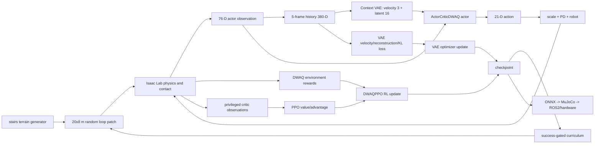
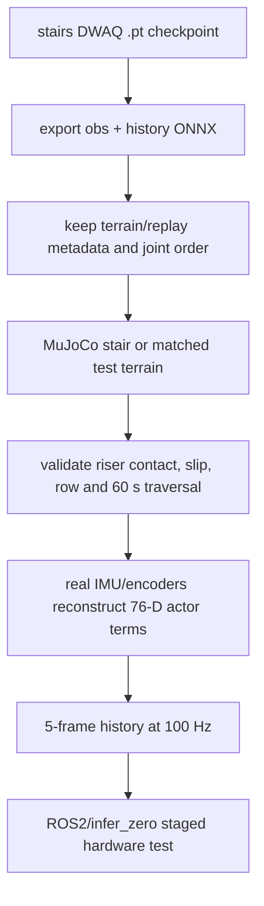

<p align='center'><a href='#zh'>中文</a> | <a href='#en'>English</a></p>
<a id='zh'></a>

# 上台阶训练架构（DWAQ + PPO + β-VAE）

## 1. 项目定位

本项目是双足人形机器人的独立楼梯行走训练项目。它复用 `03_walk` 的 DWAQ actor、Context β-VAE、privileged critic、PPO 和环境奖励，但使用独立的随机楼梯 terrain generator 与成功门控 curriculum。因此楼梯的任务 ID、实验目录、checkpoint 和导出包必须与平地行走分开。

| 项目项 | 当前配置 |
|---|---|
| Train task | `LeggedLab-Isaac--DWAQ-Lens110-Stairs-v0` |
| Play task | `LeggedLab-Isaac--DWAQ-Lens110-Stairs-PLAY-v0` |
| 环境基类 | `Lens110StairsDwaqEnvCfg(Lens110DwaqEnvCfg)` |
| 算法 | `ActorCriticDWAQ` + `DWAQPPO` + β-VAE |
| actor / history / action | `76 / 380 / 21` |
| physics / policy | `500 Hz / 100 Hz`，`0.002 s / decimation 5` |
| episode | `60 s` |
| terrain | `LENS110_RANDOM_STAIRS_ROUGH_TERRAINS_CFG` |
| terrain patch | `20×8 m`、6 rows、12 columns |
| surface height | 难度约 `5..30 cm` |
| 初始难度 | `max_init_terrain_level=0` |

## 2. DWAQ 在楼梯上的原理

楼梯任务仍是盲行走：actor 不直接接收真实 base linear velocity。它从 5 帧历史中提取 19 维 context（速度 3 + latent 16），再与当前 76 维观测拼接，输出 21 维关节动作。楼梯几何通过物理接触、关节状态、IMU 和足端反馈间接影响策略，不额外假设一个可直接读取的楼梯高度输入。

与平地 DWAQ 的区别不在网络，而在训练分布和 curriculum：

- terrain generator 由平地/混合地形改为随机连续循环路径。
- 每个环境从 row 0 开始，只有完整走完当前 patch 才积累成功次数。
- 连续两次成功才升阶；失败才降阶。
- `terrain_levels` 表示 terrain row/难度等级，不是完成百分比，也不是当前行走距离。

## 3. 总体流程图



## 4. 训练框架构成

| 层 | 实现 | 作用 |
|---|---|---|
| Terrain | `LENS110_RANDOM_STAIRS_ROUGH_TERRAINS_CFG`、`Lens110RandomLoopTerrainCfg` | 生成相连的随机高度循环路径 |
| Environment | `Lens110StairsDwaqEnvCfg` | 复用 DWAQ scene/commands/rewards，替换 terrain/curriculum |
| Actor | `ActorCriticDWAQ` | 当前观测 + VAE context -> 21 action |
| Context | `ContextVAE` | 5 帧历史 -> velocity/latent code |
| Critic | privileged critic | 使用 base velocity、足端接触/位置/速度/力、root height 学 value |
| RL | `DWAQPPO` | PPO clipped policy/value + GAE |
| VAE loss | velocity MSE + next-observation reconstruction MSE + beta-KL | 训练历史编码器 |
| Curriculum | `terrain_levels_completed` | 按完整 traversal 成功/失败调 row |
| Export/replay | DWAQ ONNX、双足人形机器人 XML、deploy metadata | 验证 stairs sim2sim 和部署契约 |

楼梯配置为 `copy.deepcopy` terrain singleton，避免改变平地 DWAQ 使用的全局 terrain。训练 `curriculum=True`；PLAY 使用固定随机 patch，关闭 terrain curriculum、观测 corruption、外力和 push。

## 5. Observation 函数和维度

楼梯完全复用平地 DWAQ 的 observation contract：

| Observation term | 维度 | 含义 |
|---|---:|---|
| `base_ang_vel` | 3 | 根部角速度，训练噪声 `[-0.2,0.2]` |
| `projected_gravity` | 3 | 机体系重力方向，训练噪声 `[-0.05,0.05]` |
| `velocity_commands` | 3 | x/y/yaw 速度指令 |
| `joint_pos` | 21 | 相对默认关节位置，训练噪声 `[-0.01,0.01]` |
| `joint_vel` | 21 | 相对关节速度，训练噪声 `[-1.5,1.5]` |
| `actions` | 21 | 上一时刻动作 |
| `gait_phase` | 4 | 左右腿 sin/cos 相位，period `0.6 s` |
| **policy 总计** | **76** | `3+3+3+21+21+21+4` |

`obs_history` 使用相同 76 维 term，`history_length=5`，所以 VAE 输入为 `380`。critic 额外使用真实 `base_lin_vel`、左右足接触、足端 body-frame 位置/速度/接触力、root height；这些 privileged 量只用于训练，不能被假设为真机可用。

DWAQ context 配置为 `code_dim=19`、`velocity_dim=3`、latent `16`。actor 实际 MLP 输入为 `19+76=95`，导出的外部接口仍是 `obs [1,76]`、`obs_history [1,380]` 到 `action [1,21]`。

## 6. Reward 函数由什么构成

楼梯不另造一套会和行走不一致的 reward。每个物理/策略步使用与 `03_walk` 相同的 DWAQ 环境奖励：

| 类别 | Reward term | 权重 | 作用 |
|---|---|---:|---|
| 速度跟踪 | `track_lin_vel_xy_exp` | `+2.5` | 跟踪 yaw frame x/y 速度 |
| 速度跟踪 | `track_ang_vel_z_exp` | `+3.0` | 跟踪 yaw rate |
| 身体稳定 | `lin_vel_z_l2` | `-1.0` | 抑制垂直弹跳 |
| 身体稳定 | `ang_vel_xy_l2` | `-0.05` | 抑制 roll/pitch 角速度 |
| 身体稳定 | `flat_orientation_l2` | `-1.0` | 保持身体稳定 |
| 身体稳定 | `body_orientation_l2` | `-2.0` | 约束 `torso_yaw_link` |
| 动力学 | `energy` | `-1e-3` | 抑制能耗 |
| 动力学 | `joint_acc_l2` | `-2.5e-7` | 抑制加速度 |
| 平滑 | `action_rate_l2` | `-0.01` | 抑制动作突变 |
| 限位 | `dof_pos_limits` | `-2.0` | 远离软限位 |
| 接触 | `undesired_contacts` | `-1.0` | 非足端碰撞惩罚 |
| 接触 | `fly` | `-1.0` | 防止双脚无有效支撑 |
| 足端 | `feet_air_time` | `+0.15` | 鼓励合理摆腿节奏 |
| 足端 | `feet_slide` | `-0.25` | 惩罚接触滑步 |
| 足端 | `feet_force` | `-3e-3` | 抑制过大足端冲击 |
| 足端 | `feet_too_near` | `-2.0` | 防止双脚过近/绊倒 |
| 足端 | `feet_heading_alignment` | `-2.0` | 约束脚朝向 |
| 足端 | `feet_stumble` | `-2.0` | 惩罚足端异常撞击 |
| 姿态 | hip deviation | `-0.3` | 髋 yaw/roll 偏差 |
| 姿态 | ankle deviation | `-0.2` | 踝部偏差 |
| 姿态 | arms deviation | `-0.2` | torso/肩/肘偏差 |
| 终止 | `termination_penalty` | `-200.0` | 失败/摔倒强惩罚 |
| 生存 | `alive` | `+0.15` | 未终止存活收益 |
| 防偷懒 | `idle_penalty` | `-2.0` | 有命令却原地不动 |
| 腿部先验 | `leg_ref_joint_pos` | `+0.5` | 约束腿部参考轨迹 |
| 步态先验 | `gait_phase_contact` | `+0.2` | 约束相位和足端接触 |

上述是 `RewardManager` 环境奖励。DWAQ 算法层另外计算 velocity MSE、next-observation reconstruction MSE 和 `beta*KL`；这三项不属于楼梯 reward，也不因为 terrain 变成奖励项。

## 7. 成功门控 terrain curriculum

```text
初始：terrain row = 0
episode success = time_out 且未 terminated
              且实际存活时间接近 60 s
              且 root 平面位移 > terrain 长度的一半
成功一次：success streak + 1
连续成功两次：terrain row + 1，streak 清零
失败：terrain row - 1（由 terrain manager 限制下界），streak 清零
```

成功判定使用真实 episode elapsed time 和 root 位移，不使用 alive reward 的随机 episode buffer，也不把 `terrain_levels` 当作百分比。这个课程只负责改变 terrain row；它不修改 actor observation、VAE code、reward 权重或 action contract。

## 8. 训练、导出和目录

```text
data/terrain/source/                 # terrain generator 和配置入口
experiments/dwaq_runs/               # 楼梯训练日志/checkpoint
exports/packages/                    # 楼梯独立发布包
exports/training_packages/           # 楼梯训练包
docs/REWARD_STRUCTURE.md             # 奖励结构证据
docs/TRAINING_ARCHITECTURE.md        # 本文
```

训练入口：

```bash
./projects/06_stairs/scripts/train.sh --headless --num_envs 4096
```

训练复现必须记录 terrain seed、row、patch 尺寸、成功 streak、command range、checkpoint、76/380/21 interface 和回放时长。不要直接用 flat-walk 的 export package 冒充 stair package。

## 9. 导出、MuJoCo 和真机



真机不读取 Isaac terrain height、critic privileged feet force/contact 或 VAE velocity target；硬件只构建与训练一致的 actor/history 输入。楼梯仿真通过不代表真机已经验证楼梯冲击，实际硬件测试需低速度、低增益、限位、急停、人工看护和可回退策略。

## 10. 复现验收清单

- [ ] task ID 是 `LeggedLab-Isaac--DWAQ-Lens110-Stairs-v0`，不是 flat walk。
- [ ] actor/history/action 为 76/380/21，DWAQ code 为 19（3+16）。
- [ ] stairs terrain 是独立 deep copy，训练 row 从 0 开始。
- [ ] 成功需要接近完整 60 s、无失败、位移超过 patch 一半；连续两次才升阶。
- [ ] reward 与 flat DWAQ 一致，VAE loss 单独记录。
- [ ] terrain seed、row、success streak 和 checkpoint 可复现。
- [ ] MuJoCo 使用匹配 XML/mesh/terrain、四元数、频率和 joint order。
- [ ] 真机只使用可测 actor 观测，有急停和限幅。

<a id='en'></a>

# Stair Training Architecture (DWAQ + PPO + beta-VAE)

## Scope

This repository trains stair walking for a bipedal humanoid robot as a separate task. It reuses the flat-walking DWAQ actor, Context beta-VAE, privileged critic, PPO algorithm, and reward terms, but uses an independent randomized loop terrain and success-gated curriculum. The stair task, runs, checkpoints, and export packages must remain separate from flat walking.

The actor contract is 76 observations, a five-frame 380-dimensional history, and 21 actions. The Context VAE produces a 19-dimensional code: 3 velocity dimensions plus 16 latent dimensions. The external ONNX probe is `obs [1,76]` plus `obs_history [1,380]` to `action [1,21]`. Physics runs at 500 Hz and the policy at 100 Hz.

## Terrain curriculum

The terrain is `LENS110_RANDOM_STAIRS_ROUGH_TERRAINS_CFG`: a 20 by 8 meter patch with six rows and twelve columns. The connected random loop surface ranges from approximately 5 to 30 cm as difficulty increases. Training starts at row 0. A success requires natural timeout, no termination, nearly the full 60-second episode, and root displacement greater than half the terrain length. Two consecutive successes promote the row; a failure demotes it. `terrain_levels` is a row/difficulty index, not a percentage.

## Observation and reward

The 76 actor values are 3 angular velocity, 3 projected gravity, 3 velocity commands, 21 relative joint positions, 21 relative joint velocities, 21 previous actions, and 4 gait-phase sin/cos values. The critic additionally receives privileged velocity, feet contact/position/velocity/force, and root height. The environment reward is the DWAQ reward: linear/angular tracking `+2.5/+3.0`, stability and dynamics costs, contact/feet terms, posture penalties, termination `-200`, alive `+0.15`, idle `-2.0`, leg-reference `+0.5`, and gait-phase contact `+0.2`.

The velocity MSE, next-observation reconstruction MSE, and `beta*KL` are DWAQ algorithm losses, not terrain rewards. The stair project does not invent a second reward system; only terrain generation and curriculum are independent.

## Reproduction and deployment

Run `./projects/06_stairs/scripts/train.sh --headless --num_envs 4096` with the local Isaac Lab environment. Record terrain seed, row, success streak, command range, checkpoint, interface shapes, joint order, and replay duration. Export both current observation and history, replay on matching MuJoCo terrain/XML, and only then connect a ROS2/infer_zero adapter. Hardware reconstructs the same actor terms from real sensors and does not use terrain height or privileged critic values.
